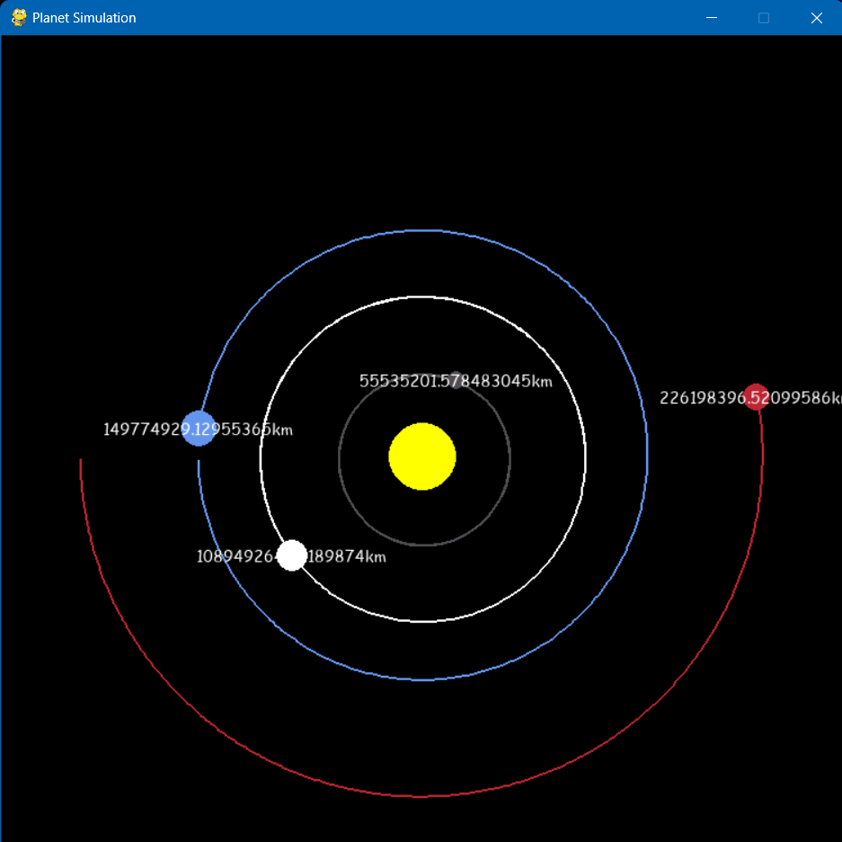

# Python Planet Simulation

This project is a simple 2D simulation of planetary orbits, demonstrating how planets orbit around a central star using basic physics principles.



## Features

- Visualizes planetary orbits in 2D.
- Uses basic physics to simulate orbital mechanics.
- Runs with minimal setup.

## How to Run

1. Clone the repository:
   ```sh
   git clone https://github.com/hussienK/Python-Planet-Simulation.git
   cd Python-Planet-Simulation
2. Run the program:
   ```sh
   python main.py

## Contribution

Contributions are welcome! If you have suggestions or improvements, feel free to open an issue or submit a pull request.
